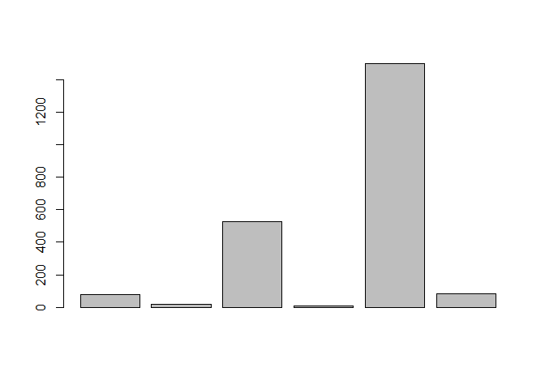
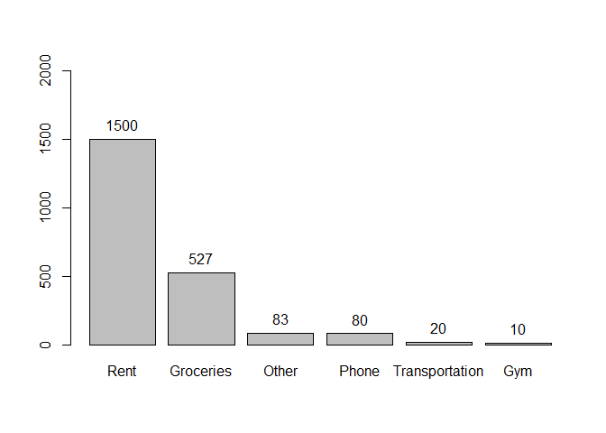

Lab 1: Basics of R
================
Sudarshan Srirangapatanam
September 1, 2017

Expenses
--------

``` r
phone <- 80
transportation <- 20
groceries <- 527
gym <- 10
rent <- 1500
other <- 83

total <- phone + transportation + groceries + gym + rent + other # Total Expenses
semester <- total * 5 # Semester Expenses
year <- total * 10 # Year Expenses

expenses <- c("Phone" = phone, "Transportation" = transportation, "Groceries" = groceries, "Gym" = gym, "Rent" = rent, "Other" = other)
sorted_exp <- sort(expenses, decreasing = TRUE) # Sorting expenses
```

Total Expenses = 2220<br> Semester Expenses = 1.1110^{4}<br> Year Expenses = 2.2210^{4}

Expenses Vector:<br> 80, 20, 527, 10, 1500, 83

**Barplot and plot sorted plus text:**

``` r
barplot(expenses, names.arg = "")
```



``` r
bar_plot <- barplot(sorted_exp, ylim = c(0, 2000))
plot_text <- bar_plot + text(bar_plot, sorted_exp, labels = sorted_exp, pos = 3)
```



Pythagoras formula
------------------

``` r
a <- 3
b <- 4
c <- sqrt(a^2 + b^2)
```

$$c = \\sqrt{a^2 + b^2}$$
 a = 3, b = 4, c = 5

Binomial Formula
----------------

``` r
n <- 5 # number of trials
k <- 2 # number of successes
p <- .5 # prob. of a success

## using factorial method
n_k <- factorial(n)/(factorial(k)*factorial(n-k))
coin_fact <- n_k * p^k * p^(n-k)

## using choose method
coin_choose <- choose(n, k) * p^k * p^(n-k)

dice_choose <- choose(10, 3) * (1/6)^3 * (1 - 1/6)^(10-3) # 3 out of 10 six on a dice

## using dbinom method
coin_binom <- dbinom(2, 5, .5) # 2 out of 5 heads
dice_binom <- dbinom(3, 10, 1/6) # 3 out of 10 six on a dice
dice_binom_three <- dbinom(3, 3, 1/6) # 3 out of 3 six on a dice

# To calculate probability with baised coing P(head) = .35
coin_baised <- dbinom(2, 5, .35)

# More than 3 heads with P(head) = .35
coin_sum <- dbinom(4, 5, .35) + dbinom(5, 5, .35) # OR
coin_sum_cdf <- 1 - pbinom(3, 5, .35)

# Installing package
#install.packages("stringr")
#install.packages("RColorBrewer")
#install.packages("XML")

# Calculating 3x^2 + 4x + 8
x <- 2
eqn_two <- 3*x^2 + 4*x + 8

y <- (-3:3)
eqn_series <- 3*y^2 + 4*y + 8
```

$$Pr(k;n,p) = Pr(X = k) = {n \\choose k}p^k (1-p)^{n-k}$$
 **2 heads out of 5 coin tosses:**

-   Using factorial() method:<br> *P**r*(2, 5, .5) = 0.3125
-   Using choose() method:<br> *P**r*(2, 5, .5) = 0.3125
-   Using dbinom() method:<br> *P**r*(2, 5, .5) = 0.3125

**3 sixes out of 10 dice throws:**

-   Using choose() method:<br> $Pr(3, 10, \\frac{1}{6})$ = 0.1550454
-   Using dbinom() method:<br> $Pr(3, 10, \\frac{1}{6})$ = 0.1550454

**3 sixes out of 3 dice throws:**

-   using dbinom() method:<br> $Pr(3, 3, \\frac{1}{6})$ = 0.0046296

**Coin tosses of a baised coin Pr(heads) = .35:**

-   *P**r*(2, 5, .35) = 0.3364156
-   Using dbinom() method:<br> *P**r*(*X* &gt; 3)=*P**r*(4, 5, .35)+*P**r*(5, 5, .35) = 0.0540225
-   Using pbinom() method:<br> *P**r*(*X* &gt; 3)=1 − *P**r*(*X* ≤ 3) = 0.0540225

**Calculating 3*x*<sup>2</sup> + 4*x* + 8:**

-   When x = 2,<br> 3*x*<sup>2</sup> + 4*x* + 8 = 28
-   When x is a series from -3 to 3,<br> 3*x*<sup>2</sup> + 4*x* + 8 = \[23, 12, 7, 8, 15, 28, 47\]
