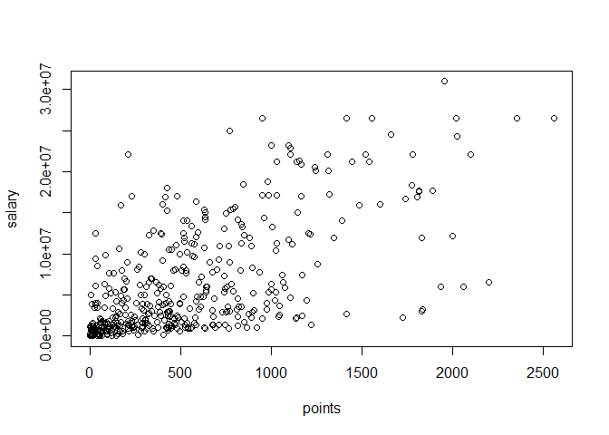
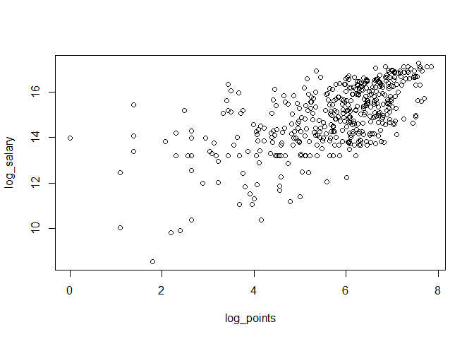
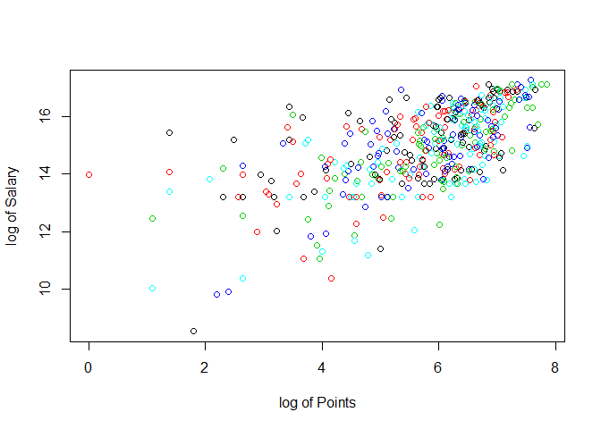

Lab 2: Vectors and other data structures
================
Sudarshan Srirangapatanam
September 1, 2017

``` r
require(knitr)
```

    ## Loading required package: knitr

``` r
rm(list = ls()) # Cleaning workplace

load("data/nba2017-salary-points.RData") # Load data

check_length <- function(...){
  num <- length(list(...))
  lengths <- 0
  for (i in 1:num){
    lengths[i] <- length(list(...)[[i]])
  }
  for (j in 1:(num-1))
  return("All objects are of Equal length")
}

four <- player[1:4] # First four players
```

Variable used and descriptions
------------------------------

Data is taken from [`nba2017-salary-points`](https://github.com/Sudarshan-UCB/stat-133-fall2017/blob/master/labs/Lab02/data/nba2017-salary-points.RData)

-   `player`: name of the player.<br> Class of object: character<br> This object is a Vector: TRUE<br> Summary (Length): 441

-   `team`: team name abbreviation.<br> Class of object: factor<br> This object is a Vector: FALSE<br> Summary: List of Teams that correspond to the player.

-   `position`: player position.<br> Class of object: character<br> This object is a Vector: TRUE<br> Summary (Length): 441

-   `salary`: salary (in dollars).<br> Class of object: numeric<br> This object is a Vector: TRUE<br> Summary (Min, Median, Mean, Max): 5145, 3.510^{6}, 6.187013910^{6}, 3.09634510^{7}

-   `points`: total scored points.<br> Class of object: integer<br> This object is a Vector: TRUE<br> Summary (Min, Median, Mean, Max): 0, 432, 546.6054422, 2558

-   `points1`: number of free throws, worth 1 point each.<br> Class of object: integer<br> This object is a Vector: TRUE<br> Summary (Min, Median, Mean, Max): 0, 58, 92.4671202, 746

-   `points2`: number of 2-point field goals, worth 2 points each.<br> Class of object: integer<br> This object is a Vector: TRUE<br> Summary (Min, Median, Mean, Max): 0, 111, 152.5079365, 730

-   `points3`: number of 3-point field goals, worth 3 points each.<br> Class of object: integer<br> This object is a Vector: TRUE<br> Summary (Min, Median, Mean, Max): 0, 32, 49.707483, 324

**Do all the objects have the same length?**<br> All objects are of Equal length

**First four player:**<br> Al Horford, Amir Johnson, Avery Bradley, Demetrius Jackson

**What happens if you specify:**

-   an index of zero: `four[0]`?<br> <br> We always get a "0" as an answer with the same class as the original vector. Simply put we get a null vector.

-   a negative index: `four[-1]`?<br> Amir Johnson, Avery Bradley, Demetrius Jackson<br> The value of index associated with the negative sign is removed.

-   various negative indices: `four[-c(1,2,3)]`?<br> Demetrius Jackson<br> All indexes associated with negative is removed.

-   an index greater than the length of the vector: `four[5]`?<br> NA<br> We always get a "NA" as an answer.

-   repeated indices: `four[c(1,2,2,3,3,3)]`?<br> Al Horford, Amir Johnson, Amir Johnson, Avery Bradley, Avery Bradley, Avery Bradley<br> The value of the index is used everytime an index is encountered. Repeated indices results in repeated value.

Using `seq()` and `rep()`:
--------------------------

``` r
even <- seq(from = 0, to = length(player), by = 2) # all even indexes
odd <- seq(from = 1, to = length(player), by = 2) # all odd indexes
fives <- seq(from = 0, to = length(player), by = 5) # multiples of five
tens <- seq(from = 0, to = length(player), by = 10) # multiples of tens 
even_rev <- rev(seq(from = 0, to = length(player), by = 2)) # all even indexes in reverse order

player_even <- player[even]
salary_odd <- salary[odd]
team_fives <- team[fives]
points_tens <- points[tens]
team_even_rev <- team[even_rev]
```

*Only a few first and last elements are shown*

all the even elements in `player`:<br> Amir Johnson, Demetrius Jackson, Isaiah Thomas, James Young, Jonas Jerebko, Kelly Olynyk, Derrick Jones, Dragan Bender, Eric Bledsoe, Leandro Barbosa, Ronnie Price, Tyler Ulis

all the odd elements in `salary`:<br> 2.6540110^{7}, 8.26966310^{6}, 1.41059810^{6}, 6.28640810^{6}, 4.74310^{6}, 1.22365310^{6}, 2.223610^{6}, 2.306910^{4}, 1.04710^{7}, 2.9414410^{6}, 2.1289210^{6}, 1.241510^{7}

all multiples of 5 (e.g. 5, 10, 15, etc) of `team`:<br> 2, 2, 2, 6, 6, 6, 14, 14, 14, 24, 24, 24

elements in positions 10, 20, 30, 40, etc of `points`:<br> 299, 6, 630, 253, 24, 101, 470, 197, 209, 425, 168, 444

all the even elements in `team` but this time in reverse order:<br> 24, 24, 24, 24, 24, 24, 2, 2, 2, 2, 2, 2

Logical Subsetting
------------------

``` r
logical_a <- four[c(TRUE, TRUE, TRUE, TRUE)]
logical_b <- four[c(TRUE, TRUE, FALSE, FALSE)]
logical_c <- four[c(FALSE, FALSE, TRUE, TRUE)]
logical_d <- four[c(TRUE, FALSE, TRUE, FALSE)]
logical_e <- four[c(FALSE, FALSE, FALSE, FALSE)]

recycle_a <- four[TRUE]
recycle_b <- four[c(TRUE, FALSE)]

# Commands to questions after Your Turn
logical_gsw <- player[team == "GSW" & position == "C"]
logical_gsw_lal <- player[team == "GSW" | team == "LAL"]
logical_lal_sg_pg_lal <- player[team == "LAL" & (position == "SG" | position == "PG")]
logical_gsw_lal_sf <- player[position == "SF" & (team == "GSW" & team == "LAL")]
logical_high <- player[salary == max(salary)]
logical_low <- player[salary == min(salary)]
logical_high_pt <- player[points == max(points)]
logical_high_pt_sal <- salary[points == max(points)]
salary_high_c <- max(salary[position == "C"])
logical_team_high_pt <- team[points == max(points)]
logical_high_3pt <- player[points3 == max(points3)]

# Subsetting with character vector
warriors_player <- player[team == "GSW"]

warriors_salary <- salary[team == "GSW"]
warriors_points <- points[team == "GSW"]
names(warriors_salary) <- warriors_player # Assinging names
```

-   `four[c(TRUE, TRUE, TRUE, TRUE)]`:<br> Al Horford, Amir Johnson, Avery Bradley, Demetrius Jackson

-   `four[c(TRUE, TRUE, FALSE, FALSE)]`:<br> Al Horford, Amir Johnson

-   `four[c(FALSE, FALSE, TRUE, TRUE)]`:<br> Avery Bradley, Demetrius Jackson

-   `four[c(TRUE, FALSE, TRUE, FALSE)]`:<br> Al Horford, Avery Bradley

-   `four[c(FALSE, FALSE, FALSE, FALSE)]`:<br>

-   `four[TRUE]`:<br> Al Horford, Amir Johnson, Avery Bradley, Demetrius Jackson

-   `four[c(TRUE, FALSE)]`:<br> Al Horford, Avery Bradley

-   players in position Center, of Warriors (GSW):<br> Damian Jones, David West, JaVale McGee, Kevon Looney, Zaza Pachulia

-   players of both GSW (warriors) and LAL (lakers):<br> Andre Iguodala, Damian Jones, David West, Draymond Green, Ian Clark, James Michael McAdoo, JaVale McGee, Kevin Durant, Kevon Looney, Klay Thompson, Matt Barnes, Patrick McCaw, Shaun Livingston, Stephen Curry, Zaza Pachulia, Brandon Ingram, Corey Brewer, D'Angelo Russell, David Nwaba, Ivica Zubac, Jordan Clarkson, Julius Randle, Larry Nance Jr., Luol Deng, Metta World Peace, Nick Young, Tarik Black, Thomas Robinson, Timofey Mozgov, Tyler Ennis

-   players in positions Shooting Guard and Point Guards, of Lakers (LAL):<br> D'Angelo Russell, David Nwaba, Jordan Clarkson, Nick Young, Tyler Ennis

-   subset Small Forwards of GSW and LAL:<br>

-   name of the player with largest salary:<br> LeBron James

-   name of the player with smallest salary:<br> Edy Tavares

-   name of the player with largest number of points:<br> Russell Westbrook

-   salary of the player with largest number of points:<br> 2.6540110^{7}

-   largest salary of all Centers:<br> 2.6540110^{7}

-   team of the player with the largest number of points:<br> OKC

-   name of the player with the largest number of 3-pointers:<br> Stephen Curry

-   `warriors_player`:<br> Andre Iguodala, Damian Jones, David West, Draymond Green, Ian Clark, James Michael McAdoo, JaVale McGee, Kevin Durant, Kevon Looney, Klay Thompson, Matt Barnes, Patrick McCaw, Shaun Livingston, Stephen Curry, Zaza Pachulia

-   `warriors_salary`:<br> 1.113136810^{7}, 1.1715610^{6}, 1.55165910^{6}, 1.533043510^{7}, 1.01569610^{6}, 9.8043110^{5}, 1.40361110^{6}, 2.6540110^{7}, 1.1828410^{6}, 1.666357510^{7}, 3.8335110^{5}, 5.4347110^{5}, 5.7824510^{6}, 1.211235910^{7}, 2.89810^{6}

-   `warriors_points`:<br> 574, 19, 316, 776, 527, 147, 472, 1555, 135, 1742, 114, 282, 389, 1999, 426

-   Using Character subsetting:<br> 1.113136810<sup>{7}<br>\\ 1.211235910</sup>{7}, 2.6540110^{7}

Plotting
--------

**Scatter plot of `points` and `salary`:**

``` r
plot(points, salary)
```



**Looking at the generated plot, can you see any issues?**<br> Plot is too crowded on one corner but not ont he other corner. Plot doesn't have enough resolution to estimate a pattern at first sight.

**Scatter plot using log transformed vectors:**

``` r
log_points <- log(points)
log_salary <- log(salary)
plot(log_points, log_salary)
```



``` r
#text(log_points, log_salary, labels = abbreviate(player)) # Adding and shortening names
```

Recycling
---------

``` r
salary_millions <- salary / (10^6)

#height_cms <- height * 2.54 # This is not given the data
```

Factors
-------

``` r
position_fac <- as.factor(position)

# Manipulating factors
factor_a <- position_fac[team == "GSW"]
factor_b <- position_fac[salary_millions > 15]
factor_c <- table(position_fac[salary_millions > 15])
factor_d <- prop.table(table(team[position_fac == 'SG']))
```

**Is team a factor:** TRUE

Frequencies of positions:<br>

|     |     |
|:----|----:|
| C   |   89|
| PF  |   89|
| PG  |   85|
| SF  |   83|
| SG  |   95|

**manipulating factors:**

-   positions of Warriors:<br> SF, C, C, PF, SG, PF, C, SF, C, SG, SF, SG, PG, PG, C

-   positions of players with salaries &gt; 15 millions:<br> C, PF, PG, SF, C, SG, SG, C, PG, C, SF, PF, C, SF, SF, SG, SF, PG, C, C, PF, SG, SF, PG, C, C, SG, C, PF, SF, SG, SF, PF, C, PG, PF, PF, PG, C, SF, C, PG, SF, C, PG, SG, PG, SF, SF, C, C, PF, PF, SG, SF, C

-   frequencies (counts) of positions with salaries &gt; 15 millions:<br>

|     |     |
|:----|----:|
| C   |   17|
| PF  |    9|
| PG  |    9|
| SF  |   13|
| SG  |    8|

-   relative frequencies (proportions) of 'SG' (Shooting Guards) in each team:<br>

|     |           |
|:----|----------:|
| ATL |  0.0105263|
| BOS |  0.0315789|
| BRK |  0.0421053|
| CHI |  0.0421053|
| CHO |  0.0421053|
| CLE |  0.0315789|
| DAL |  0.0210526|
| DEN |  0.0421053|
| DET |  0.0315789|
| GSW |  0.0315789|
| HOU |  0.0315789|
| IND |  0.0210526|
| LAC |  0.0315789|
| LAL |  0.0315789|
| MEM |  0.0315789|
| MIA |  0.0421053|
| MIL |  0.0421053|
| MIN |  0.0210526|
| NOP |  0.0210526|
| NYK |  0.0421053|
| OKC |  0.0210526|
| ORL |  0.0421053|
| PHI |  0.0210526|
| PHO |  0.0421053|
| POR |  0.0421053|
| SAC |  0.0526316|
| SAS |  0.0526316|
| TOR |  0.0315789|
| UTA |  0.0210526|
| WAS |  0.0315789|

Colored Plot
------------

``` r
plot(log_points, log_salary, col = position_fac, xlab = "log of Points", ylab = "log of Salary")
```


