Lab 5: First contact with dplyr and ggplot2
================
Sudarshan Srirangapatanam
September 13, 2017

Data
----

``` r
require("knitr") #used for kable() function
```

    ## Loading required package: knitr

``` r
require("dplyr") #used for data wrangling
```

    ## Loading required package: dplyr

    ## 
    ## Attaching package: 'dplyr'

    ## The following objects are masked from 'package:stats':
    ## 
    ##     filter, lag

    ## The following objects are masked from 'package:base':
    ## 
    ##     intersect, setdiff, setequal, union

``` r
require("ggplot2") #used fro plots
```

    ## Loading required package: ggplot2

``` r
dat <- read.csv('data/nba2017-players.csv', stringsAsFactors = FALSE)

lal_players <- dat %>% filter(team == "LAL") %>% select(player)
```

**The data used in this lab is taken from [nba2017-players](https://github.com/Sudarshan-UCB/stat-133-fall2017/blob/master/labs/Lab05/data/nba2017-players.csv)**

### Basic "dplyr" verbs

-   use `slice()` to subset the data by selecting the first 5 rows.<br>

| player            | team | position |  height|  weight|  age|  experience| college                       |    salary|  games|  minutes|  points|  points3|  points2|  points1|
|:------------------|:-----|:---------|-------:|-------:|----:|-----------:|:------------------------------|---------:|------:|--------:|-------:|--------:|--------:|--------:|
| Al Horford        | BOS  | C        |      82|     245|   30|           9| University of Florida         |  26540100|     68|     2193|     952|       86|      293|      108|
| Amir Johnson      | BOS  | PF       |      81|     240|   29|          11|                               |  12000000|     80|     1608|     520|       27|      186|       67|
| Avery Bradley     | BOS  | SG       |      74|     180|   26|           6| University of Texas at Austin |   8269663|     55|     1835|     894|      108|      251|       68|
| Demetrius Jackson | BOS  | PG       |      73|     201|   22|           0| University of Notre Dame      |   1450000|      5|       17|      10|        1|        2|        3|
| Gerald Green      | BOS  | SF       |      79|     205|   31|           9|                               |   1410598|     47|      538|     262|       39|       56|       33|

-   use `slice()` to subset the data by selecting rows 10, 15, 20, ..., 50.<br>

| player           | team | position |  height|  weight|  age|  experience| college                       |    salary|  games|  minutes|  points|  points3|  points2|  points1|
|:-----------------|:-----|:---------|-------:|-------:|----:|-----------:|:------------------------------|---------:|------:|--------:|-------:|--------:|--------:|--------:|
| Jonas Jerebko    | BOS  | PF       |      82|     231|   29|           6|                               |   5000000|     78|     1232|     299|       45|       69|       26|
| Edy Tavares      | CLE  | C        |      87|     260|   24|           1|                               |      5145|      1|       24|       6|        0|        3|        0|
| Tristan Thompson | CLE  | C        |      81|     238|   25|           5| University of Texas at Austin |  15330435|     78|     2336|     630|        0|      262|      106|
| Lucas Nogueira   | TOR  | C        |      84|     241|   24|           2|                               |   1921320|     57|     1088|     253|        3|      100|       44|
| Daniel Ochefu    | WAS  | C        |      83|     245|   23|           0| Villanova University          |    543471|     19|       75|      24|        0|       12|        0|

-   use `slice()` to subset the data by selecting the last 5 rows.<br>

| player        | team | position |  height|  weight|  age|  experience| college                      |   salary|  games|  minutes|  points|  points3|  points2|  points1|
|:--------------|:-----|:---------|-------:|-------:|----:|-----------:|:-----------------------------|--------:|------:|--------:|-------:|--------:|--------:|--------:|
| Jordan Mickey | BOS  | PF       |      80|     235|   22|           1| Louisiana State University   |  1223653|     25|      141|      38|        0|       15|        8|
| Kelly Olynyk  | BOS  | C        |      84|     238|   25|           3| Gonzaga University           |  3094014|     75|     1538|     678|       68|      192|       90|
| Marcus Smart  | BOS  | SG       |      76|     220|   22|           2| Oklahoma State University    |  3578880|     79|     2399|     835|       94|      175|      203|
| Terry Rozier  | BOS  | PG       |      74|     190|   22|           1| University of Louisville     |  1906440|     74|     1263|     410|       57|       94|       51|
| Tyler Zeller  | BOS  | C        |      84|     253|   27|           4| University of North Carolina |  8000000|     51|      525|     178|        0|       78|       22|

-   use `filter()` to subset those players with height less than 70 inches tall.<br>

| player        | team | position |  height|  weight|  age|  experience| college                  |   salary|  games|  minutes|  points|  points3|  points2|  points1|
|:--------------|:-----|:---------|-------:|-------:|----:|-----------:|:-------------------------|--------:|------:|--------:|-------:|--------:|--------:|--------:|
| Isaiah Thomas | BOS  | PG       |      69|     185|   27|           5| University of Washington |  6587132|     76|     2569|    2199|      245|      437|      590|
| Kay Felder    | CLE  | PG       |      69|     176|   21|           0| Oakland University       |   543471|     42|      386|     166|        7|       55|       35|

-   use `filter()` to subset rows of Golden State Warriors ('GSW').\*<br>

| player               | team | position |  height|  weight|  age|  experience| college                      |    salary|  games|  minutes|  points|  points3|  points2|  points1|
|:---------------------|:-----|:---------|-------:|-------:|----:|-----------:|:-----------------------------|---------:|------:|--------:|-------:|--------:|--------:|--------:|
| Andre Iguodala       | GSW  | SF       |      78|     215|   33|          12| University of Arizona        |  11131368|     76|     1998|     574|       64|      155|       72|
| Damian Jones         | GSW  | C        |      84|     245|   21|           0| Vanderbilt University        |   1171560|     10|       85|      19|        0|        8|        3|
| David West           | GSW  | C        |      81|     250|   36|          13| Xavier University            |   1551659|     68|      854|     316|        3|      132|       43|
| Draymond Green       | GSW  | PF       |      79|     230|   26|           4| Michigan State University    |  15330435|     76|     2471|     776|       81|      191|      151|
| Ian Clark            | GSW  | SG       |      75|     175|   25|           3| Belmont University           |   1015696|     77|     1137|     527|       61|      150|       44|
| James Michael McAdoo | GSW  | PF       |      81|     230|   24|           2| University of North Carolina |    980431|     52|      457|     147|        2|       60|       21|

-   use `filter()` to subset rows of GSW centers ('C').\*<br>

| player           | team | position |  height|  weight|  age|  experience| college                       |    salary|  games|  minutes|  points|  points3|  points2|  points1|
|:-----------------|:-----|:---------|-------:|-------:|----:|-----------:|:------------------------------|---------:|------:|--------:|-------:|--------:|--------:|--------:|
| Al Horford       | BOS  | C        |      82|     245|   30|           9| University of Florida         |  26540100|     68|     2193|     952|       86|      293|      108|
| Kelly Olynyk     | BOS  | C        |      84|     238|   25|           3| Gonzaga University            |   3094014|     75|     1538|     678|       68|      192|       90|
| Tyler Zeller     | BOS  | C        |      84|     253|   27|           4| University of North Carolina  |   8000000|     51|      525|     178|        0|       78|       22|
| Channing Frye    | CLE  | C        |      83|     255|   33|          10| University of Arizona         |   7806971|     74|     1398|     676|      137|      101|       63|
| Edy Tavares      | CLE  | C        |      87|     260|   24|           1|                               |      5145|      1|       24|       6|        0|        3|        0|
| Tristan Thompson | CLE  | C        |      81|     238|   25|           5| University of Texas at Austin |  15330435|     78|     2336|     630|        0|      262|      106|

-   use `filter()` and then `select()`, to subset rows of lakers ('LAL'), and then display their names.\*<br> Brandon Ingram, Corey Brewer, D'Angelo Russell, David Nwaba, Ivica Zubac, Jordan Clarkson

-   use `filter()` and then `select()`, to display the name and salary, of GSW point guards.\*<br>

| player           |    salary|
|:-----------------|---------:|
| Shaun Livingston |   5782450|
| Stephen Curry    |  12112359|

-   find how to select the name, age, and team, of players with more than 10 years of experience, making 10 million dollars or less.\*<br>

| player            |  age| team |
|:------------------|----:|:-----|
| Dahntay Jones     |   36| CLE  |
| Deron Williams    |   32| CLE  |
| James Jones       |   36| CLE  |
| Kyle Korver       |   35| CLE  |
| Richard Jefferson |   36| CLE  |
| Jose Calderon     |   35| ATL  |

-   find how to select the name, team, height, and weight, of rookie players, 20 years old, displaying only the first five occurrences (i.e. rows).<br>

| player            | team |  height|  weight|
|:------------------|:-----|-------:|-------:|
| Jaylen Brown      | BOS  |      79|     225|
| Henry Ellenson    | DET  |      83|     245|
| Stephen Zimmerman | ORL  |      84|     240|
| Dejounte Murray   | SAS  |      77|     170|
| Chinanu Onuaku    | HOU  |      82|     245|

*\* only a small suset is shown using the `head()` function to reduce report length*

### Adding new variables: `mutate()`

``` r
gsw <- filter(dat, team == 'GSW')
gsw <- select(gsw, player, height, weight)
gsw <- slice(gsw, c(4, 8, 10, 14, 15))
gsw
```

    ## # A tibble: 5 x 3
    ##           player height weight
    ##            <chr>  <int>  <int>
    ## 1 Draymond Green     79    230
    ## 2   Kevin Durant     81    240
    ## 3  Klay Thompson     79    215
    ## 4  Stephen Curry     75    190
    ## 5  Zaza Pachulia     83    270

``` r
gsw3 <- mutate(gsw, log_height = log(height), log_weight = log(weight))

gsw_mpg <- dat %>% filter(team == "GSW") %>% mutate(min_per_game = minutes / games) %>% select(player, experience, min_per_game) %>% arrange(desc(min_per_game))
```

-   using the data frame `gsw`, add a new variable `product` with the product of `height` and `weight`.<br>

| player         |  height|  weight|  product|
|:---------------|-------:|-------:|--------:|
| Draymond Green |      79|     230|    18170|
| Kevin Durant   |      81|     240|    19440|
| Klay Thompson  |      79|     215|    16985|
| Stephen Curry  |      75|     190|    14250|
| Zaza Pachulia  |      83|     270|    22410|

-   create a new data frame `gsw3`, by adding columns `log_height` and `log_weight` with the log transformations of `height` and `weight`.<br>

| player         |  height|  weight|  log\_height|  log\_weight|
|:---------------|-------:|-------:|------------:|------------:|
| Draymond Green |      79|     230|     4.369448|     5.438079|
| Kevin Durant   |      81|     240|     4.394449|     5.480639|
| Klay Thompson  |      79|     215|     4.369448|     5.370638|
| Stephen Curry  |      75|     190|     4.317488|     5.247024|
| Zaza Pachulia  |      83|     270|     4.418841|     5.598422|

-   use the original data frame to `filter()` and `arrange()` those players with height less than 71 inches tall, in increasing order.<br>

| player        | team | position |  height|  weight|  age|  experience| college                  |   salary|  games|  minutes|  points|  points3|  points2|  points1|
|:--------------|:-----|:---------|-------:|-------:|----:|-----------:|:-------------------------|--------:|------:|--------:|-------:|--------:|--------:|--------:|
| Isaiah Thomas | BOS  | PG       |      69|     185|   27|           5| University of Washington |  6587132|     76|     2569|    2199|      245|      437|      590|
| Kay Felder    | CLE  | PG       |      69|     176|   21|           0| Oakland University       |   543471|     42|      386|     166|        7|       55|       35|
| Tyler Ulis    | PHO  | PG       |      70|     150|   21|           0| University of Kentucky   |   918369|     61|     1123|     444|       21|      163|       55|

-   display the name, team, and salary, of the top-5 highest paid players<br>

| player        | team |    salary|
|:--------------|:-----|---------:|
| LeBron James  | CLE  |  30963450|
| Al Horford    | BOS  |  26540100|
| DeMar DeRozan | TOR  |  26540100|
| Kevin Durant  | GSW  |  26540100|
| James Harden  | HOU  |  26540100|

-   display the name, team, and points3, of the top 10 three-point players<br>

| player         | team |  points3|
|:---------------|:-----|--------:|
| Stephen Curry  | GSW  |      324|
| Klay Thompson  | GSW  |      268|
| James Harden   | HOU  |      262|
| Eric Gordon    | HOU  |      246|
| Isaiah Thomas  | BOS  |      245|
| Kemba Walker   | CHO  |      240|
| Bradley Beal   | WAS  |      223|
| Damian Lillard | POR  |      214|
| Ryan Anderson  | HOU  |      204|
| J.J. Redick    | LAC  |      201|

-   create a data frame `gsw_mpg` of GSW players, that contains variables for player name, experience, and `min_per_game` (minutes per game), sorted by `min_per_game` (in descending order).\*<br>

| player         |  experience|  min\_per\_game|
|:---------------|-----------:|---------------:|
| Klay Thompson  |           5|        33.96154|
| Stephen Curry  |           7|        33.39241|
| Kevin Durant   |           9|        33.38710|
| Draymond Green |           4|        32.51316|
| Andre Iguodala |          12|        26.28947|
| Matt Barnes    |          13|        20.50000|

*\* only a small suset is shown using the `head()` function to reduce report length*

### Summarizing values with `summarise()`

-   use `summarise()` to get the largest height value.<br> 87

-   use `summarise()` to get the standard deviation of `points3`.<br> 55.9720966

-   use `summarise()` and `group_by()` to display the median of three-points, by team.<br>

| team |  median|
|:-----|-------:|
| ATL  |    32.5|
| BOS  |    46.0|
| BRK  |    44.0|
| CHI  |    32.0|
| CHO  |    17.0|
| CLE  |    62.0|
| DAL  |    53.0|
| DEN  |    53.0|
| DET  |    28.0|
| GSW  |    18.0|
| HOU  |    27.5|
| IND  |    22.5|
| LAC  |    38.0|
| LAL  |    10.0|
| MEM  |    25.0|
| MIA  |    74.0|
| MIL  |    47.0|
| MIN  |    35.0|
| NOP  |    36.5|
| NYK  |    23.0|
| OKC  |    12.0|
| ORL  |    40.0|
| PHI  |    27.0|
| PHO  |    26.0|
| POR  |    32.5|
| SAC  |    34.0|
| SAS  |    23.0|
| TOR  |    24.0|
| UTA  |    37.0|
| WAS  |    21.0|

-   display the average triple points by team, in ascending order, of the bottom-5 teams (worst 3pointer teams)<br>

| team |   average|
|:-----|---------:|
| NOP  |  36.64286|
| SAC  |  37.20000|
| PHO  |  37.60000|
| CHI  |  37.66667|
| LAL  |  39.46667|

-   obtain the mean and standard deviation of `age`, for Power Forwards, with 5 and 10 years (including) years of experience.<br> 28.1290323, 1.8026265

### First contact with `ggplot()`

``` r
ggplot(gsw)+
  geom_point(aes(x = height, y = weight))
```

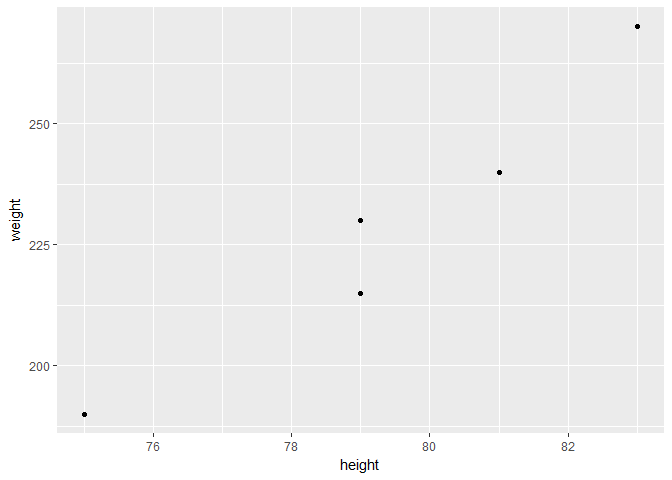

``` r
ggplot(gsw, aes(x = height, y = weight))+
  geom_point()+
  geom_text(aes(label = player))
```

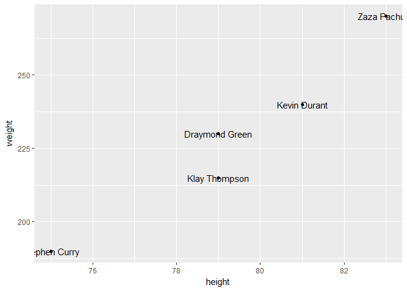

``` r
dat %>% filter(team == "GSW") %>% ggplot(aes(x = height, y = weight))+
  geom_label(aes(label = player))
```

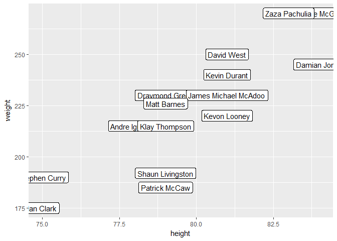

``` r
ggplot(dat, aes(x = salary))+
  geom_density()
```

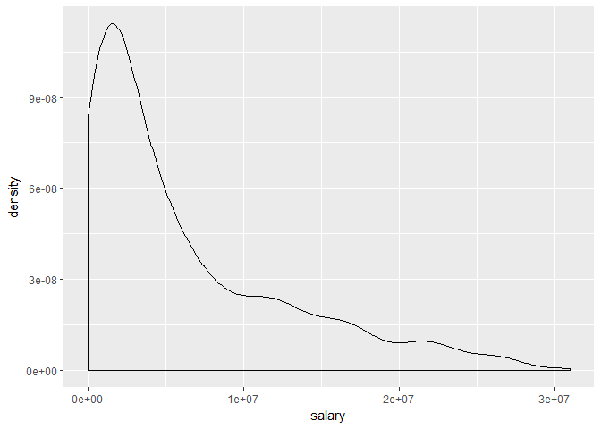

``` r
ggplot(dat, aes(x = points2))+
  geom_histogram(binwidth = 50)
```

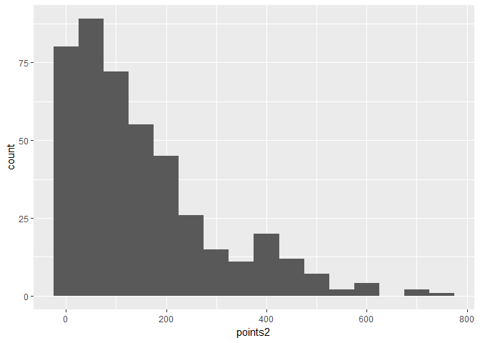

``` r
ggplot(dat, aes(x = position))+
  geom_bar()
```

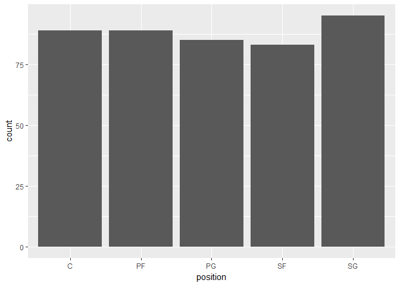

``` r
dat %>% filter(position == "C") %>% ggplot(aes(x = experience, y = salary))+
  geom_point()+
  geom_smooth(method = "lm")
```

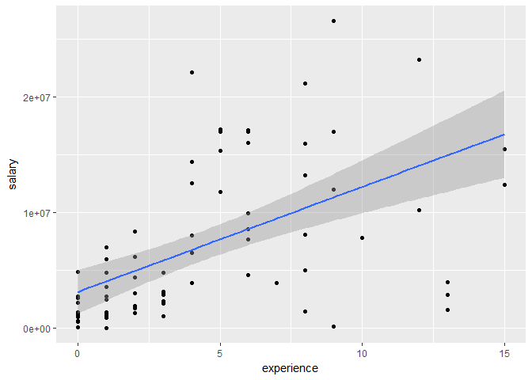

``` r
dat %>% filter(position == "C") %>% ggplot(aes(x = experience, y = salary))+
  geom_point()+
  geom_smooth(method = "loess")
```

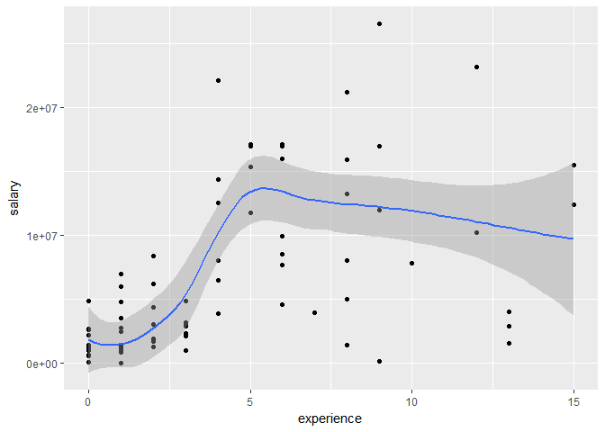

### Faceting

``` r
ggplot(dat, aes(x = experience, y = salary))+
  geom_point()+
  facet_wrap(~ position)
```

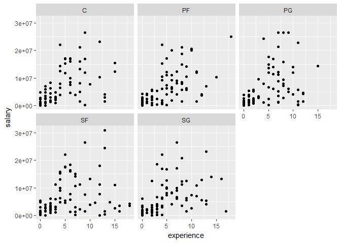

``` r
ggplot(dat, aes(x = experience, y = salary))+
  geom_point()+
  facet_wrap(~ team)
```

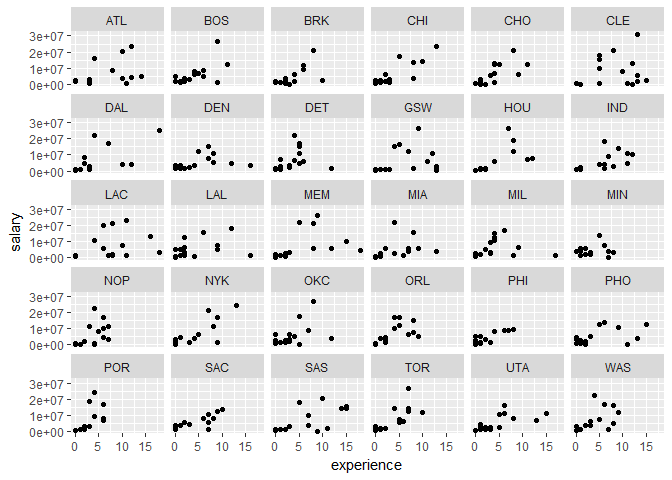

``` r
ggplot(dat, aes(x = age))+
  geom_density()+
  facet_wrap(~ team)
```

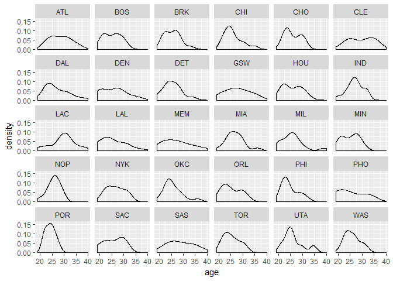

``` r
ggplot(dat, aes(x = height, y = weight))+
  geom_point()+
  facet_wrap(~ position)
```

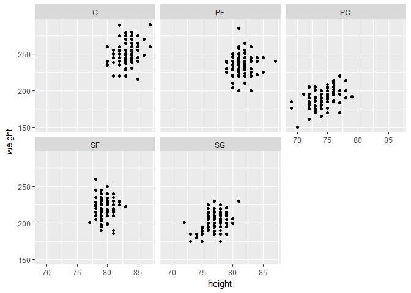

``` r
ggplot(dat, aes(x = height, y = weight))+
  geom_point()+
  geom_density2d()+
  facet_grid(~ position)
```

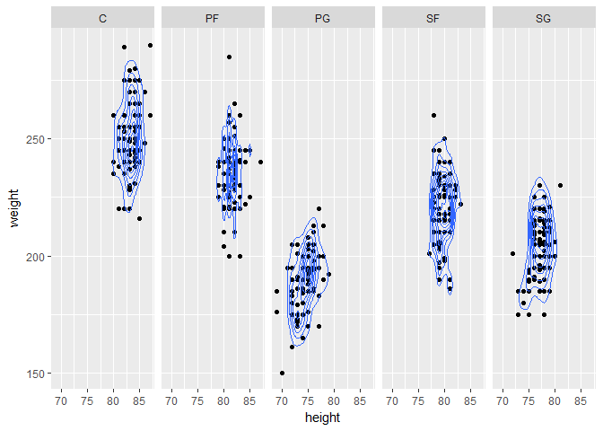
