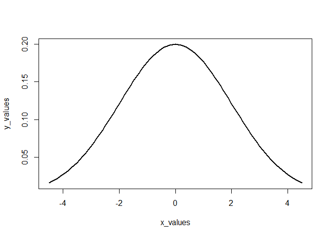

Lab 7: Simple Functions and Conditionals
================
Sudarshan Srirangapatanam

Setup
-----

``` r
library("knitr")
library("dplyr")
```

    ## 
    ## Attaching package: 'dplyr'

    ## The following objects are masked from 'package:stats':
    ## 
    ##     filter, lag

    ## The following objects are masked from 'package:base':
    ## 
    ##     intersect, setdiff, setequal, union

``` r
library("ggplot2")
library("readr")

knitr::opts_chunk$set(fig.path = "../images/")
```

-   `knitr` is used for knitting the document as well as other fucntions to cleanup the output
-   `readr` is used for reading data into R
-   `dplyr` is used for data wrangling
-   `ggplot2` is used to generate any necessary plots

``` r
f <- function(x) {
  x^2
}

g <- function(x){
  (2*x) +5
}

fog <- function(x){
  g_x <- g(x)
  f(g_x)
}

gof <- function(x){
  f_x <- f(x)
  g(f_x)
}

pythagoras <- function(a, b = a){
  sqrt(a^2 + b^2)
}

miles2kms <- function(a = 1){
  a * 1.6
}

gallons2liters <- function(g = 1){
  g * 3.78541
}

liters2gallons <- function(l = 1){
  gallons2liters(l) / gallons2liters(1)^2
}

seconds2years <- function(sec){
  min <- (1/60) * sec
  hour <- (1/60) * min
  day <- (1/24) * hour
  year <- (1/365.25) * day
  year
}

gaussian <- function(x, m, s){
  exp(-.5 * ((x - m) / s)^2) / (s * sqrt(2*pi))
}
```

-   f(2): 4
-   f(-5): 25

-   g(0): 5
-   g(-5/2): 0

-   fog(2): 81
-   fog(-5): 25

-   gof(0): 5
-   gof(-5/2): 17.5

-   pythagoras(3, 4): 5
-   pythagoras(5): 7.0710678

-   testing `miles2kms()`:

|  miles|    kms|
|------:|------:|
|      1|    1.6|
|      2|    3.2|
|      3|    4.8|
|      4|    6.4|
|      5|    8.0|
|      6|    9.6|
|      7|   11.2|
|      8|   12.8|
|      9|   14.4|
|     10|   16.0|
|     20|   32.0|
|     30|   48.0|
|     40|   64.0|
|     50|   80.0|
|     60|   96.0|
|     70|  112.0|
|     80|  128.0|
|     90|  144.0|
|    100|  160.0|

-   testing `liters2gallons()`:

|  liters|     gallons|
|-------:|-----------:|
|       1|   0.2641722|
|       2|   0.5283444|
|       3|   0.7925165|
|       4|   1.0566887|
|       5|   1.3208609|
|       6|   1.5850331|
|       7|   1.8492052|
|       8|   2.1133774|
|       9|   2.3775496|
|      10|   2.6417218|
|      20|   5.2834435|
|      30|   7.9251653|
|      40|  10.5668871|
|      50|  13.2086088|
|      60|  15.8503306|
|      70|  18.4920524|
|      80|  21.1337741|
|      90|  23.7754959|
|     100|  26.4172177|

-   seconds2years(1000000000) 31.6880878<br> Can a newborn baby in USA expect to live for one billion (10^9) seconds?<br> Yes, because life expectancy is 79 years.

-   `gaussian()` evaluated at x = 1, m = 0, and s = 2: 0.1760327<br> `dnorm()` fucntion: 0.1760327

``` r
x_values <- seq(-4.5, 4.5, .1)
y_values <- gaussian(x_values, 0, 2)
plot(x_values, y_values, type = "l", lwd = 2)
```


