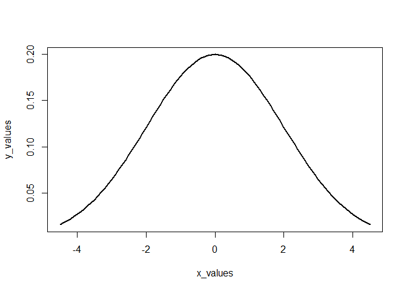
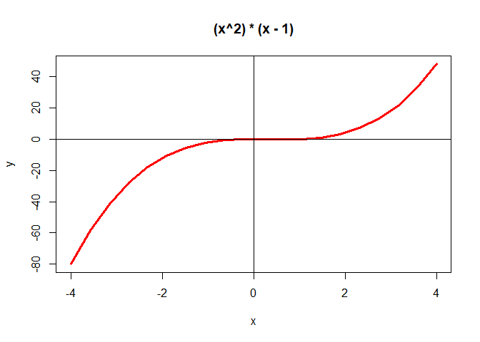
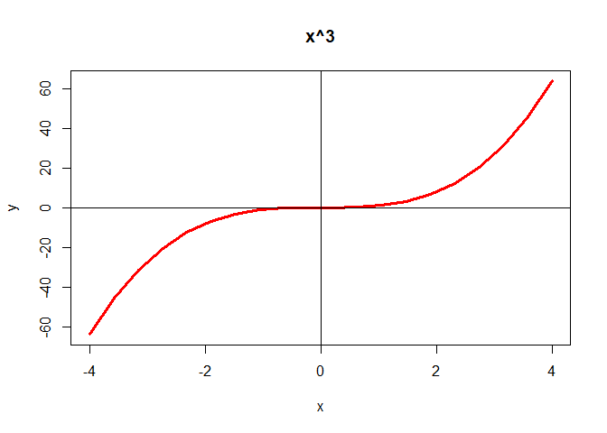
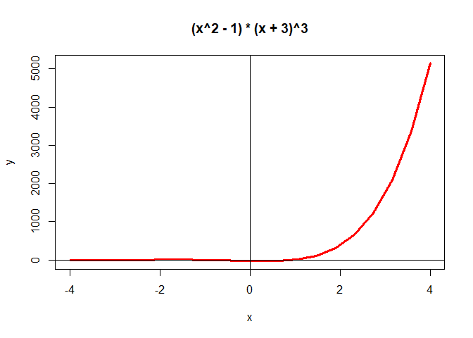
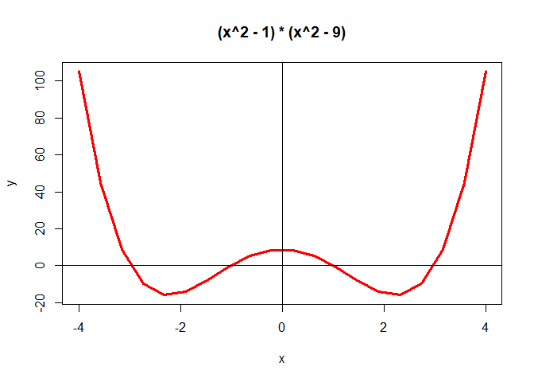

Lab 7: Simple Functions and Conditionals
================
Sudarshan Srirangapatanam

Setup
-----

``` r
library("knitr")
library("dplyr")
```

    ## 
    ## Attaching package: 'dplyr'

    ## The following objects are masked from 'package:stats':
    ## 
    ##     filter, lag

    ## The following objects are masked from 'package:base':
    ## 
    ##     intersect, setdiff, setequal, union

``` r
library("ggplot2")
library("readr")

knitr::opts_chunk$set(fig.path = "../images/")
```

-   `knitr` is used for knitting the document as well as other fucntions to cleanup the output
-   `readr` is used for reading data into R
-   `dplyr` is used for data wrangling
-   `ggplot2` is used to generate any necessary plots

``` r
f <- function(x){
  x^2
}

g <- function(x){
  (2*x) +5
}

fog <- function(x){
  g_x <- g(x)
  f(g_x)
}

gof <- function(x){
  f_x <- f(x)
  g(f_x)
}

pythagoras <- function(a, b = a){
  sqrt(a^2 + b^2)
}
```

-   f(2): 4
-   f(-5): 25

-   g(0): 5
-   g(-5/2): 0

-   fog(2): 81
-   fog(-5): 25

-   gof(0): 5
-   gof(-5/2): 17.5

-   pythagoras(3, 4): 5
-   pythagoras(5): 7.0710678

``` r
miles2kms <- function(a = 1){
  a * 1.6
}

gallons2liters <- function(g = 1){
  g * 3.78541
}

liters2gallons <- function(l = 1){
  gallons2liters(l) / gallons2liters(1)^2
}

seconds2years <- function(sec){
  min <- (1/60) * sec
  hour <- (1/60) * min
  day <- (1/24) * hour
  year <- (1/365.25) * day
  year
}
```

-   testing `miles2kms()`:

|  miles|    kms|
|------:|------:|
|      1|    1.6|
|      2|    3.2|
|      3|    4.8|
|      4|    6.4|
|      5|    8.0|
|      6|    9.6|
|      7|   11.2|
|      8|   12.8|
|      9|   14.4|
|     10|   16.0|
|     20|   32.0|
|     30|   48.0|
|     40|   64.0|
|     50|   80.0|
|     60|   96.0|
|     70|  112.0|
|     80|  128.0|
|     90|  144.0|
|    100|  160.0|

-   testing `liters2gallons()`:

|  liters|     gallons|
|-------:|-----------:|
|       1|   0.2641722|
|       2|   0.5283444|
|       3|   0.7925165|
|       4|   1.0566887|
|       5|   1.3208609|
|       6|   1.5850331|
|       7|   1.8492052|
|       8|   2.1133774|
|       9|   2.3775496|
|      10|   2.6417218|
|      20|   5.2834435|
|      30|   7.9251653|
|      40|  10.5668871|
|      50|  13.2086088|
|      60|  15.8503306|
|      70|  18.4920524|
|      80|  21.1337741|
|      90|  23.7754959|
|     100|  26.4172177|

-   seconds2years(1000000000) 31.6880878<br> Can a newborn baby in USA expect to live for one billion (10^9) seconds?<br> Yes, because life expectancy is 79 years.

``` r
gaussian <- function(x, m, s){
  exp(-.5 * ((x - m) / s)^2) / (s * sqrt(2*pi))
}

plot_points <- function(fxn){
  x <- seq(-4, 4, length.out = 20)
  y <- fxn(x)
  plot(x, y, type = "l", lwd = 3, col = "red")
  abline(h = 0, v = 0)
  title(main = paste(body(fxn))[2])
}

poly1 <- function(x){
  (x^2) * (x - 1)
}

poly2 <- function(x){
  x^3
}

poly3 <- function(x){
  (x^2 - 1) * (x + 3)^3
}

poly4 <- function(x){
  (x^2 - 1) * (x^2 - 9)
}
```

-   `gaussian()` evaluated at x = 1, m = 0, and s = 2: 0.1760327<br> `dnorm()` fucntion: 0.1760327

``` r
x_values <- seq(-4.5, 4.5, .1)
y_values <- gaussian(x_values, 0, 2)
plot(x_values, y_values, type = "l", lwd = 2)
```



``` r
plot_points(poly1)
```



``` r
plot_points(poly2)
```



``` r
plot_points(poly3)
```



``` r
plot_points(poly4)
```



``` r
descriptive <- function(x){
  out <- c("min" = min(x),
           "q1" = quantile(x, probs = .25),
           "median" = median(x),
           "mean" = mean(x),
           "q3" = quantile(x, probs = .75),
           "max" = max(x),
           "range" = range(x),
           "iqr" = IQR(x),
           "sd" = sd(x))
  return(out)
}

combinations <- function(n, k){
  factorial(n) / (factorial(k) * factorial(n - k))
}

binom_prob <- function(n, k, prob){
  combinations(n, k) * prob^k * (1 - prob)^(n-k)
}
```

-   testing `descriptive()`:<br> -2.7742235, -0.7095931, -0.0266347, -0.0312425, 0.7110431, 2.5661068, -2.7742235, 2.5661068, 1.4206363, 0.9490751

-   testing `combinations()`:<br> `choose(n = 5, k = 2)` = 10<br> `combinations(n = 5, k = 2)` = 10

-   testing `binom_prob()`:<br> `binom_prob(n = 5, k = 2, prob = 0.5)` = 0.3125 \`<br> more than 3 heads in 5 tosses, with a bais of 35%: 0.0540225<br> getting 3/6 sixes: 0.1550454

``` r
squish_0_100 <- function(x){
  if (x < 0){
    return(0)
  } else if (x > 100){
    return(100)
  } else {
    return(x)
  }
}

is_even <- function(x){
  if (is.numeric(x)){
    if (x %% 2 == 0){
      return(TRUE)
    } else {
      return(FALSE)
    }
  } else {
    return(NA)
  }
}

is_odd <- function(x){
  if (is.na(is_even(x))){
    return(NA)
  } else if (is_even(x)){
    return(FALSE)
  } else {
    return(TRUE)
  }
}
```

-   testing `squish`:<br> x = -5: 0<br> x = 51: 51<br> x = 175: 100

-   testing `is_even()`:<br> `is_even(10)`: TRUE<br> `is_even(33)`: FALSE<br> `is_even('a')`: NA

-   testing `is_odd()`:<br> `is_odd(1)`: TRUE<br> `is_odd(4)`: FALSE<br> `is_odd('a')`: NA

``` r
grade <- function(score){
  if (score > 100 | score < 0){
    stop("score must be a number between 0 and 100")
  } else if (score <= 100 & score >= 90){
    return("A")
  } else if (score < 90 & score >= 80){
    return("B")
  } else if (score < 80 & score >= 70){
    return("C")
  } else if (score < 70 & score >= 60){
    return("D")
  } else {
    return("F")
  }
}
```

-   testing `grade()`:<br> `grade(score = 90)`: A<br> `grade(score = 89.9999)`: B<br> `grade(score = 70.0000001)`: C<br> `grade(score = 50)`: F<br> `grade(score = -5)`: <br> `grade(score = 101)`:

``` r
miles2inches <- function(x = 1){
  x * 63360
}

miles2feet <- function(x = 1){
  x * 5280
}

miles2yards <- function(x = 1){
  x * 1760
}

miles2meters <- function(x = 1){
  x / 0.00062137
}

miles2kms <- function(x = 1){
  x / 0.62137
}

convert <- function(mi, to = "km"){
  switch(to,
         "in" = miles2inches(mi),
         "ft" = miles2feet(mi),
         "yd" = miles2yards(mi),
         "m" = miles2meters(mi),
         "km" = miles2kms(mi),
         NA)
}
```

-   testing convertion functions:<br> `miles2inches(2)`: 1.267210^{5}<br> `miles2feet(2)`: 1.05610^{4}<br> `miles2yards(2)`: 3520<br> `miles2meters(2)`: 3218.6941758<br> `miles2kms(2)`: 3.2186942

-   testing `convert()`:<br> `convert(3, "in")`: 1.900810^{5}<br> `convert(3, "ft")`: 1.58410^{4}<br> `convert(3, "yd")`: 5280<br> `convert(3, "m")`: 4828.0412637<br> `convert(3, "km")`: 4.8280413
