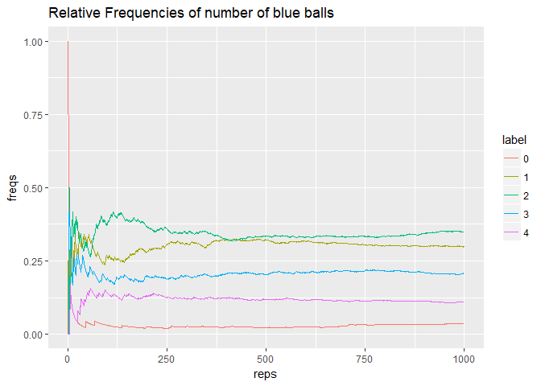

Testing a new markdown format
================
Sudarshan Srirangapatanam
Sat Oct 28 09:18:19 2017

Setup
-----

``` r
library(knitr)
library(dplyr)
library(ggplot2)
library(readr)
library(shiny)

knitr::opts_chunk$set(fig.path = "../images/")
```

-   `knitr` is used for knitting the document as well as other fucntions to cleanup the output
-   `readr` is used for reading data into R
-   `dplyr` is used for data wrangling
-   `ggplot2` is used to generate any necessary plots
-   `shiny` is used for shiny apps

Functions used
--------------

``` r
sample.box <- function(prob = 0.5) {
  x <- runif(1)
  if (x > prob) {
    return(sample(box1, size = 4, replace = TRUE))
  }
  
  return(sample(box2, size = 4, replace = FALSE))
}

run.exp1 <- function(times = 1, prob = 0.5) {
  result <- matrix(data = NA, nrow = times, ncol = 4)
  for (i in 1:times) {
    result[i,] <- sample.box(prob = prob)
  }
  
  return(result)
}

tidy.draws <- function(x, color = "blue") {
  draws <- ifelse(x == color, 1, 0)
  
  dat <- data.frame(run_number = rep(1:nrow(draws),5),
                    ncolor = rep(rowSums(draws),5),
                    label = rep(c("0", "1", "2", "3", "4"), each = nrow(draws)))
  
  dat <- dat %>% group_by(label) %>% mutate(cumulative = cumsum(ncolor == label), prop = cumulative/run_number)
  
  return(dat)
}
```

Above functions are created for the purposes listed below:

-   `sample.box`: to simulate 4 draws from box2 without replacement with probabilty given by *prob* and to simualte 4 draws from box1 with replacement with probability *1 - prob*. prob defaults to 0.5. Output is a vector of length 4.

-   `run.exp1`: to simulate draws from boxes number of time given by *times*. times defaults ot 1. Output is a matrix with i-th row corresponding to i-th game and j-th coloumn corresponding to j-th draw of i-th game.

-   `tidy.draws`: to organize a draws matrix with essential numbers such as total number of *color* balls in a game. color defaults to blue. Output is a dataframe with game number, number of balls of given colors, label correcponsing to the number of balls, and cumulative sum by labels.

Code for draws and plot
-----------------------

``` r
box1 <- c(rep("blue", 2), "red")
box2 <- c(rep("blue", 2), rep("red", 3), "white")

set.seed(123)
drawn_balls <- run.exp1(1000)
blue_dat <- tidy.draws(drawn_balls)

plot_blue <- ggplot(blue_dat, aes(x = run_number, y = cumulative/run_number))+
  geom_line(aes(color = label))+
  labs(x = "reps", y = "freqs", title = "Relative Frequencies of number of blue balls")
```

seed was set to **123**

``` r
print(plot_blue)
```



Shiny App code
--------------

``` r
ui <- fluidPage(
  
  titlePanel("Drawing Balls Experiment"),
  
  sidebarLayout(
    sidebarPanel(
      sliderInput("reps", label = "Number of repititions", min = 1, max = 5000, value = 100),
      
      sliderInput("pr_box", label = "Threshold for choosing the boxes", min = 0, max = 1, value = .5),
      
      selectInput("color", label = "Choose the color of the ball", choices = unique(c(box1, box2))),
      
      numericInput("seed", label = "Choose a random seed", min = 0, value = 12345)
    ),
    
    mainPanel(
      plotOutput("sim_plot")
    )
  )

)

server <- function(input, output){
  plot_data <- reactive({
    set.seed(input$seed)
    data <- tidy.draws(run.exp1(input$reps, input$pr_box), color = input$color)
    return(data)
  })
  
  output$sim_plot <- renderPlot({
    ggplot(plot_data(), aes(x = run_number, y = cumulative/run_number))+
      geom_line(aes(color = label))+
      labs(x = "reps", y = "freqs", title = paste("Relative Frequencies of number of ", "blue", " balls"))
  })
}

shinyApp(ui = ui, server = server)
```

<!--html_preserve-->
Shiny applications not supported in static R Markdown documents

<!--/html_preserve-->
