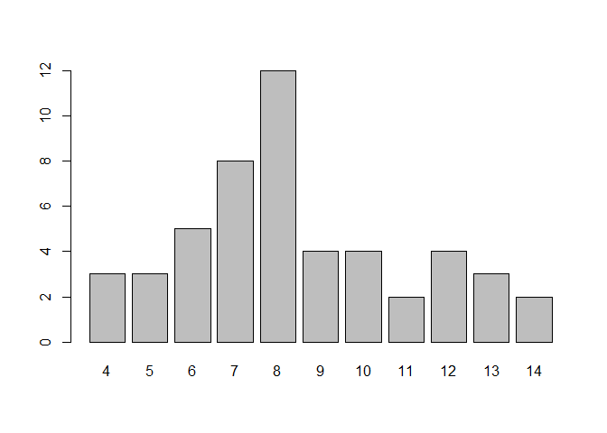
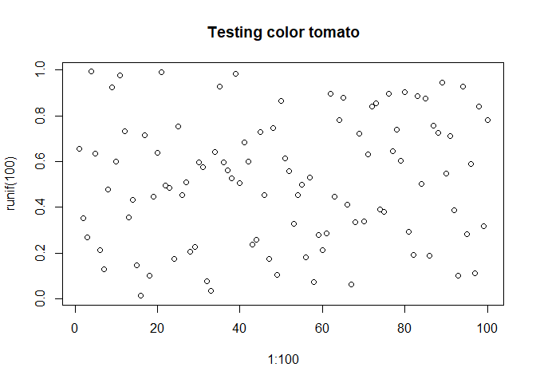

Lab10
================
Sudarshan Srirangapatanam
Fri Nov 03 15:52:24 2017

-   [Setup](#setup)
    -   [Case folding on states:](#case-folding-on-states)
    -   [Frequency table on chars](#frequency-table-on-chars)
    -   [Pasting strings](#pasting-strings)
    -   [Substrings](#substrings)
    -   [Challenge](#challenge)
-   [Converting from Fahrenheit Degrees](#converting-from-fahrenheit-degrees)
    -   [Original function](#original-function)
    -   [Fucntion updates](#fucntion-updates)
-   [Names of files](#names-of-files)
-   [Using function `cat()`](#using-function-cat)
-   [Valid Color Names](#valid-color-names)
    -   [Plot with a valid color](#plot-with-a-valid-color)
-   [Counting number of vowels](#counting-number-of-vowels)
    -   [Number of letters, vowels, and consonants](#number-of-letters-vowels-and-consonants)

Setup
-----

``` r
library(knitr)
library(dplyr)
library(ggplot2)
library(readr)
library(shiny)

knitr::opts_chunk$set(fig.path = "../images/")
```

-   `knitr` is used for knitting the document as well as other fucntions to cleanup the output
-   `readr` is used for reading data into R
-   `dplyr` is used for data wrangling
-   `ggplot2` is used to generate any necessary plots
-   `shiny` is used for shiny apps \#\# Reading `USArrests`

``` r
states <- rownames(USArrests)

head(USArrests)
```

    ##            Murder Assault UrbanPop Rape
    ## Alabama      13.2     236       58 21.2
    ## Alaska       10.0     263       48 44.5
    ## Arizona       8.1     294       80 31.0
    ## Arkansas      8.8     190       50 19.5
    ## California    9.0     276       91 40.6
    ## Colorado      7.9     204       78 38.7

``` r
head(states)
```

    ## [1] "Alabama"    "Alaska"     "Arizona"    "Arkansas"   "California"
    ## [6] "Colorado"

*`nchar()` on states:*

| states     |  nchar..|
|:-----------|--------:|
| Alabama    |        7|
| Alaska     |        6|
| Arizona    |        7|
| Arkansas   |        8|
| California |       10|
| Colorado   |        8|

### Case folding on states:

``` r
casefold <- data.frame(states,
                       "tolower" = tolower(states),
                       "toupper" = toupper(states),
                       "(upper = TRUE)" = casefold(states, upper = TRUE),
                       "(upper = FALSE)" = casefold(states, upper = FALSE))
head(casefold)
```

    ##       states    tolower    toupper X.upper...TRUE. X.upper...FALSE.
    ## 1    Alabama    alabama    ALABAMA         ALABAMA          alabama
    ## 2     Alaska     alaska     ALASKA          ALASKA           alaska
    ## 3    Arizona    arizona    ARIZONA         ARIZONA          arizona
    ## 4   Arkansas   arkansas   ARKANSAS        ARKANSAS         arkansas
    ## 5 California california CALIFORNIA      CALIFORNIA       california
    ## 6   Colorado   colorado   COLORADO        COLORADO         colorado

### Frequency table on chars

``` r
num_chars <- nchar(states)
char_freq <- table(num_chars)
barplot(char_freq)
```



### Pasting strings

``` r
paste(states[1:5], num_chars[1:5], sep = " = ")
```

    ## [1] "Alabama = 7"     "Alaska = 6"      "Arizona = 7"     "Arkansas = 8"   
    ## [5] "California = 10"

``` r
paste(states[1:5], collapse = "")
```

    ## [1] "AlabamaAlaskaArizonaArkansasCalifornia"

### Substrings

``` r
first <- substr(states, 1, 3)
last <- substr(states, num_chars-2, num_chars)
first_last <- paste0(substr(first, 1, 1), last)
```

First 3 letters:

|     |
|:----|
| Ala |
| Ala |
| Ari |
| Ark |
| Cal |
| Col |

<br> Last 3 letters:

|     |
|:----|
| ama |
| ska |
| ona |
| sas |
| nia |
| ado |

<br> First 1 and last 3 letters:

|      |
|:-----|
| Aama |
| Aska |
| Aona |
| Asas |
| Cnia |
| Cado |

### Challenge

``` r
state_list <- function(x, char_count) {
  result <- list()
  for (i in min(char_count):max(char_count)) {
    if (i %% 2 == 0) {
      result[[paste0(i, "-chars", collapse = "")]] <- substr(toupper(x[char_count == i]), 1, i)
    } else {
      result[[paste0(i, "-chars", collapse = "")]] <- substr(tolower(x[char_count == i]), 1, i)
    }
  }
  
  return(result)
}

state_list(states, num_chars)
```

    ## $`4-chars`
    ## [1] "IOWA" "OHIO" "UTAH"
    ## 
    ## $`5-chars`
    ## [1] "idaho" "maine" "texas"
    ## 
    ## $`6-chars`
    ## [1] "ALASKA" "HAWAII" "KANSAS" "NEVADA" "OREGON"
    ## 
    ## $`7-chars`
    ## [1] "alabama" "arizona" "florida" "georgia" "indiana" "montana" "vermont"
    ## [8] "wyoming"
    ## 
    ## $`8-chars`
    ##  [1] "ARKANSAS" "COLORADO" "DELAWARE" "ILLINOIS" "KENTUCKY" "MARYLAND"
    ##  [7] "MICHIGAN" "MISSOURI" "NEBRASKA" "NEW YORK" "OKLAHOMA" "VIRGINIA"
    ## 
    ## $`9-chars`
    ## [1] "louisiana" "minnesota" "tennessee" "wisconsin"
    ## 
    ## $`10-chars`
    ## [1] "CALIFORNIA" "NEW JERSEY" "NEW MEXICO" "WASHINGTON"
    ## 
    ## $`11-chars`
    ## [1] "connecticut" "mississippi"
    ## 
    ## $`12-chars`
    ## [1] "NORTH DAKOTA" "PENNSYLVANIA" "RHODE ISLAND" "SOUTH DAKOTA"
    ## 
    ## $`13-chars`
    ## [1] "massachusetts" "new hampshire" "west virginia"
    ## 
    ## $`14-chars`
    ## [1] "NORTH CAROLINA" "SOUTH CAROLINA"

Converting from Fahrenheit Degrees
----------------------------------

### Original function

``` r
to_celsius <- function(x = 1) {
  (x - 32) * (5/9)
}

to_kelvin <- function(x = 1) {
  (x + 459.67) * (5/9)
}

to_reaumur <- function(x = 1) {
  (x - 32) * (4/9)
}

to_rankine <- function(x = 1) {
  x + 459.67
}

temp_convert <- function(x = 1, to = "celsius") {
  switch(to,
         "celsius" = to_celsius(x),
         "kelvin" = to_kelvin(x),
         "reaumur" = to_reaumur(x),
         "rankine" = to_rankine(x))
}
```

### Fucntion updates

When cases other than low are used to specify arguments the function fails to return a value. We can fix it by:

``` r
temp_convert <- function(x = 1, to = "celsius") {
  to <- tolower(to)
  switch(to,
         "celsius" = to_celsius(x),
         "kelvin" = to_kelvin(x),
         "reaumur" = to_reaumur(x),
         "rankine" = to_rankine(x))
}
# Testing
temp_convert(30, 'celsius')
```

    ## [1] -1.111111

``` r
temp_convert(30, 'Celsius')
```

    ## [1] -1.111111

``` r
temp_convert(30, 'CELSIUS')
```

    ## [1] -1.111111

Names of files
--------------

``` r
# file names and dataset names
method1 <- paste0("file", 1:10, ".csv")
method2 <- paste("file", 1:10, ".csv", sep = "")
method3 <- {
  x <- c(rep("file", 10), 1:10, rep(".csv", 10))
  z <- NULL
  for(i in 1:10) {
    z[i] <- paste0(x[i], x[i + 10], x[i + 20])
  }
  z
}

dataset <- gsub("file", "dataset", method1)
```

Using function `cat()`
----------------------

``` r
# name of output file
outfile <- "output.txt"

# modification
cat('---\ntitle: "lab10 cat()"\nauthor: "Sudarshan Srirangapatanam"\ndate: "11/3/17"\noutput: html_document\n---\n\n', file = outfile)
# writing to 'outfile.txt'
cat("This is the first line", file = outfile, append = TRUE)
# insert new line
cat("\n", file = outfile, append = TRUE)
cat("A 2nd line", file = "output.txt", append = TRUE)
# insert 2 new lines
cat("\n\n", file = outfile, append = TRUE)
cat("\nThe quick brown fox jumps over the lazy dog\n",
    file = outfile, append = TRUE)
```

see [`./output.txt`](./output.txt) for output

Valid Color Names
-----------------

``` r
is_color <- function(x) {
  colors <- colors()
  sum <- sum(colors == x)
  if(sum == 0) {
    return(FALSE)
  } else {
    return(TRUE)
  }
}
# testing
is_color('yellow')  # TRUE
```

    ## [1] TRUE

``` r
is_color('blu')     # FALSE
```

    ## [1] FALSE

``` r
is_color('turkuoise') # FALSE
```

    ## [1] FALSE

### Plot with a valid color

``` r
colplot <- function(col="") {
  if(is_color(col)) {
    return(plot(x = 1:100, y = runif(100), main = paste("Testing color", col)))
  } else{
    #stop(paste("invalid color", col))
  }
}

# testing
# this stops with error message
colplot('tomate')
```

    ## NULL

``` r
# this should plot
colplot('tomato')
```



Counting number of vowels
-------------------------

``` r
set.seed(1)
letrs <- sample(letters, size = 100, replace = TRUE)

prep.letters <- function(x) {
  x <- tolower(x)
  x <- unlist(strsplit(x, ""))
  return(x)
}

count.letters <- function(x, count_by = "abcd") {
  x <- prep.letters(x)
  count_by <- prep.letters(count_by)
  count <- NULL
  for (i in 1:length(count_by)) {
    count[i] <- sum(x == count_by[i])
  }
  names(count) <- count_by
  return(count)
}

format.counts <- function(x) {
  return(paste(names(x), ":", x))
}


count.letters(letrs, count_by = c("aeiou"))
```

    ## a e i o u 
    ## 2 2 6 2 8

``` r
count.letters(letrs, count_by = c("bcdfghjklmnpqrstvwxyz"))
```

    ## b c d f g h j k l m n p q r s t v w x y z 
    ## 3 3 3 4 6 1 5 6 4 7 2 2 5 4 5 3 4 5 4 3 1

### Number of letters, vowels, and consonants

``` r
count_letters <- function(x) {
  x <- prep.letters(x)
  
  letters <- paste("letters :", length(x))
  vowels <- paste("vowels :", sum(count.letters(x, count_by = c("aeiou"))))
  consonants <- paste("consonants :", sum(count.letters(x, count_by = c("bcdfghjklmnpqrstvwxyz"))))
  
  return(paste(letters, vowels, consonants, sep = ', '))
}

count_letters("abcd")
```

    ## [1] "letters : 4, vowels : 1, consonants : 3"
