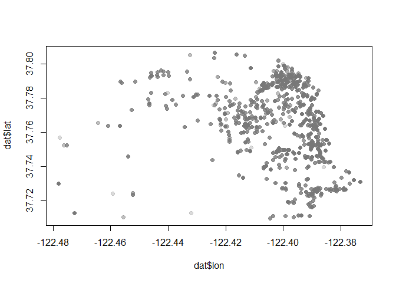
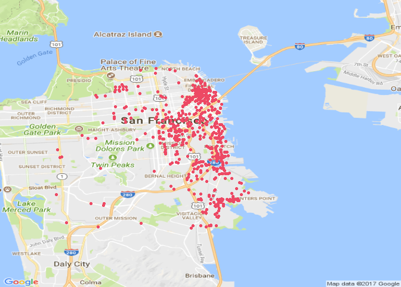
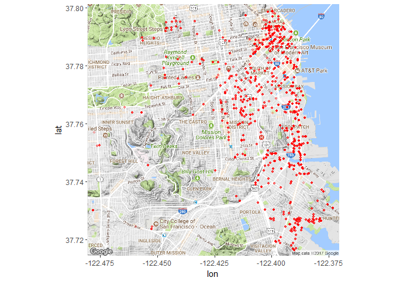
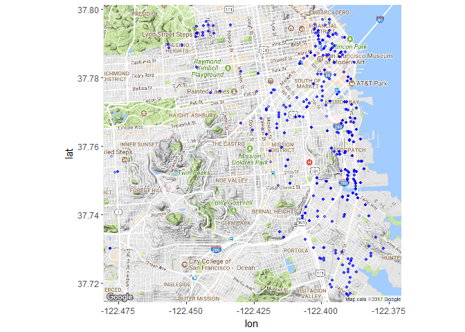

Lab11
================
Sudarshan Srirangapatanam
Sat Nov 18 18:39:35 2017

-   [Setup](#setup)
-   [Changing Times](#changing-times)
    -   [str\_sub()](#str_sub)
    -   [str\_replace()](#str_replace)
-   [Latitude and Longitude Coordinates](#latitude-and-longitude-coordinates)
    -   [Manipulating more location values](#manipulating-more-location-values)
-   [Plotting locations on a map](#plotting-locations-on-a-map)
-   [ggmap](#ggmap)
-   [Let's look for specific types of food](#lets-look-for-specific-types-of-food)
-   [Practice more Regex patterns](#practice-more-regex-patterns)

Setup
-----

``` r
library(knitr)
library(dplyr)
library(ggplot2)
library(readr)
library(shiny)
library(stringr)
library(RgoogleMaps)
library(ggmap)

knitr::opts_chunk$set(fig.path = "../images/")
```

-   `knitr` is used for knitting the document as well as other fucntions to cleanup the output
-   `readr` is used for reading data into R
-   `dplyr` is used for data wrangling
-   `ggplot2` is used to generate any necessary plots
-   `shiny` is used for shiny apps

``` r
dat <- read.csv('../data/mobile-food-sf.csv', stringsAsFactors = FALSE)
```

Changing Times
--------------

### str\_sub()

``` r
time1 <- '10AM'
str_sub(time1, start = 1, end = 2)
```

    ## [1] "10"

``` r
str_sub(time1, start = 3, end = 4)
```

    ## [1] "AM"

``` r
times <- c('12PM', '10AM', '9AM', '8AM')
# subset time
str_sub(times, 1, nchar(times) - 2)
```

    ## [1] "12" "10" "9"  "8"

``` r
# subset period
str_sub(times, nchar(times) - 1, nchar(times))
```

    ## [1] "PM" "AM" "AM" "AM"

### str\_replace()

``` r
hours <- as.numeric(str_replace(times, pattern = 'AM|PM', replacement = ''))
periods <- str_sub(times, start = -2)

to24 <- function(x) {
  period <- str_sub(x, start = -2)
  hour <- as.numeric(str_replace(x, pattern = 'AM|PM', replacement = ''))
  result <- NULL
  for (i in 1:length(x)) {
    if (period[i] == "PM" & hour[i] != 12) {
      result[i] <- hour[i] + 12
    } else if ((period[i] == "AM" & hour[i] != 12) | (period[i] == "PM" & hour[i] == 12)) {
      result[i] <- hour[i]
    } else {
      result[i] <- 0
    }
  }
  return(result)
}
start24 <- to24(times)
start24
```

    ## [1] 12 10  9  8

``` r
str(dat)
```

    ## 'data.frame':    6247 obs. of  8 variables:
    ##  $ DayOfWeekStr  : chr  "Friday" "Friday" "Friday" "Friday" ...
    ##  $ starttime     : chr  "10AM" "1PM" "10AM" "10AM" ...
    ##  $ endtime       : chr  "10PM" "2PM" "11AM" "3PM" ...
    ##  $ PermitLocation: chr  "200 SHOTWELL ST" "180 MONTGOMERY ST" "101 EXECUTIVE PARK BLVD" "290 TOWNSEND ST" ...
    ##  $ optionaltext  : chr  "Tacos, Burritos, Tortas, Quesadillas, Mexican Drinks, Aguas Frescas" "Cold Truck: sandwiches, drinks, snacks, candy, hot coffee" "Cold Truck: Pre-packaged Sandwiches, Various Beverages, Salads, Snacks" "Hot Dogs, Hamburgers, Nachos, Steaks, Pastas, Asian Dishes, Tri-Tip Sandwiches, Sodas & Water" ...
    ##  $ ColdTruck     : chr  "N" "Y" "Y" "N" ...
    ##  $ Applicant     : chr  "Santana ESG, Inc." "Sun Rise Catering" "Golden Catering" "Linda's Catering" ...
    ##  $ Location      : chr  "(37.7651967350509,-122.416451692902)" "(37.7907890558203,-122.402273431333)" "(37.7111991003088,-122.394693339395)" "(37.7773000262759,-122.394812784799)" ...

``` r
dat <- dat %>% mutate(start = to24(starttime), end = to24(endtime), duration = end - start)
str(dat)
```

    ## 'data.frame':    6247 obs. of  11 variables:
    ##  $ DayOfWeekStr  : chr  "Friday" "Friday" "Friday" "Friday" ...
    ##  $ starttime     : chr  "10AM" "1PM" "10AM" "10AM" ...
    ##  $ endtime       : chr  "10PM" "2PM" "11AM" "3PM" ...
    ##  $ PermitLocation: chr  "200 SHOTWELL ST" "180 MONTGOMERY ST" "101 EXECUTIVE PARK BLVD" "290 TOWNSEND ST" ...
    ##  $ optionaltext  : chr  "Tacos, Burritos, Tortas, Quesadillas, Mexican Drinks, Aguas Frescas" "Cold Truck: sandwiches, drinks, snacks, candy, hot coffee" "Cold Truck: Pre-packaged Sandwiches, Various Beverages, Salads, Snacks" "Hot Dogs, Hamburgers, Nachos, Steaks, Pastas, Asian Dishes, Tri-Tip Sandwiches, Sodas & Water" ...
    ##  $ ColdTruck     : chr  "N" "Y" "Y" "N" ...
    ##  $ Applicant     : chr  "Santana ESG, Inc." "Sun Rise Catering" "Golden Catering" "Linda's Catering" ...
    ##  $ Location      : chr  "(37.7651967350509,-122.416451692902)" "(37.7907890558203,-122.402273431333)" "(37.7111991003088,-122.394693339395)" "(37.7773000262759,-122.394812784799)" ...
    ##  $ start         : num  10 13 10 10 10 10 10 10 10 10 ...
    ##  $ end           : num  22 14 11 15 11 11 11 11 11 11 ...
    ##  $ duration      : num  12 1 1 5 1 1 1 1 1 1 ...

Latitude and Longitude Coordinates
----------------------------------

``` r
loc1 <- "(37.7651967350509,-122.416451692902)"
lat_lon <- str_replace_all(loc1, pattern = '\\(|\\)', replacement = '')

str_split(lat_lon, pattern = ',')
```

    ## [[1]]
    ## [1] "37.7651967350509"  "-122.416451692902"

### Manipulating more location values

``` r
locs <- c(
  "(37.7651967350509,-122.416451692902)",
  "(37.7907890558203,-122.402273431333)",
  "(37.7111991003088,-122.394693339395)",
  "(37.7773000262759,-122.394812784799)",
  NA
)
lat_lon <- {
  x <- str_replace_all(locs, pattern = '\\(|\\)', replacement = '')
  str_split(x, pattern = ',', simplify = TRUE)
}

lat <- lat_lon[,1]
lon <- lat_lon[,2]

latitude <- as.numeric(lat)
longitude <- as.numeric(lon)

get_lat <- function(x) {
  y <- str_replace_all(x, pattern = '\\(|\\)', replacement = '')
  z <- str_split(y, pattern = ',', simplify = TRUE)

  return(as.numeric(z[,1]))
}
get_long <- function(x) {
  y <- str_replace_all(x, pattern = '\\(|\\)', replacement = '')
  z <- str_split(y, pattern = ',', simplify = TRUE)

  return(as.numeric(z[,2]))
}


str(dat)
```

    ## 'data.frame':    6247 obs. of  11 variables:
    ##  $ DayOfWeekStr  : chr  "Friday" "Friday" "Friday" "Friday" ...
    ##  $ starttime     : chr  "10AM" "1PM" "10AM" "10AM" ...
    ##  $ endtime       : chr  "10PM" "2PM" "11AM" "3PM" ...
    ##  $ PermitLocation: chr  "200 SHOTWELL ST" "180 MONTGOMERY ST" "101 EXECUTIVE PARK BLVD" "290 TOWNSEND ST" ...
    ##  $ optionaltext  : chr  "Tacos, Burritos, Tortas, Quesadillas, Mexican Drinks, Aguas Frescas" "Cold Truck: sandwiches, drinks, snacks, candy, hot coffee" "Cold Truck: Pre-packaged Sandwiches, Various Beverages, Salads, Snacks" "Hot Dogs, Hamburgers, Nachos, Steaks, Pastas, Asian Dishes, Tri-Tip Sandwiches, Sodas & Water" ...
    ##  $ ColdTruck     : chr  "N" "Y" "Y" "N" ...
    ##  $ Applicant     : chr  "Santana ESG, Inc." "Sun Rise Catering" "Golden Catering" "Linda's Catering" ...
    ##  $ Location      : chr  "(37.7651967350509,-122.416451692902)" "(37.7907890558203,-122.402273431333)" "(37.7111991003088,-122.394693339395)" "(37.7773000262759,-122.394812784799)" ...
    ##  $ start         : num  10 13 10 10 10 10 10 10 10 10 ...
    ##  $ end           : num  22 14 11 15 11 11 11 11 11 11 ...
    ##  $ duration      : num  12 1 1 5 1 1 1 1 1 1 ...

``` r
dat <- dat %>% mutate(lat = get_lat(Location), lon = get_long(Location))
str(dat)
```

    ## 'data.frame':    6247 obs. of  13 variables:
    ##  $ DayOfWeekStr  : chr  "Friday" "Friday" "Friday" "Friday" ...
    ##  $ starttime     : chr  "10AM" "1PM" "10AM" "10AM" ...
    ##  $ endtime       : chr  "10PM" "2PM" "11AM" "3PM" ...
    ##  $ PermitLocation: chr  "200 SHOTWELL ST" "180 MONTGOMERY ST" "101 EXECUTIVE PARK BLVD" "290 TOWNSEND ST" ...
    ##  $ optionaltext  : chr  "Tacos, Burritos, Tortas, Quesadillas, Mexican Drinks, Aguas Frescas" "Cold Truck: sandwiches, drinks, snacks, candy, hot coffee" "Cold Truck: Pre-packaged Sandwiches, Various Beverages, Salads, Snacks" "Hot Dogs, Hamburgers, Nachos, Steaks, Pastas, Asian Dishes, Tri-Tip Sandwiches, Sodas & Water" ...
    ##  $ ColdTruck     : chr  "N" "Y" "Y" "N" ...
    ##  $ Applicant     : chr  "Santana ESG, Inc." "Sun Rise Catering" "Golden Catering" "Linda's Catering" ...
    ##  $ Location      : chr  "(37.7651967350509,-122.416451692902)" "(37.7907890558203,-122.402273431333)" "(37.7111991003088,-122.394693339395)" "(37.7773000262759,-122.394812784799)" ...
    ##  $ start         : num  10 13 10 10 10 10 10 10 10 10 ...
    ##  $ end           : num  22 14 11 15 11 11 11 11 11 11 ...
    ##  $ duration      : num  12 1 1 5 1 1 1 1 1 1 ...
    ##  $ lat           : num  37.8 37.8 37.7 37.8 NA ...
    ##  $ lon           : num  -122 -122 -122 -122 NA ...

Plotting locations on a map
---------------------------

``` r
plot(dat$lon, dat$lat, pch = 19, col = "#77777744")
```



``` r
center <- c(mean(dat$lat, na.rm = TRUE), mean(dat$lon, na.rm = TRUE))
zoom <- min(MaxZoom(range(dat$lat, na.rm = TRUE), 
  range(dat$lon, na.rm = TRUE)))

map1 <- GetMap(center=center, zoom=zoom, destfile = "../images/san-francisco.png")
PlotOnStaticMap(map1, dat$lat, dat$lon, col = "#ed4964", pch=20)
```



ggmap
-----

``` r
dat <- na.omit(dat)
sbbox <- make_bbox(lon = dat$lon, lat = dat$lat, f = .1)
sbbox
```

    ##       left     bottom      right        top 
    ## -122.48867   37.69985 -122.36281   37.81595

``` r
sf_map <- get_map(location = sbbox, maptype = "terrain", source = "google")
```

    ## Warning: bounding box given to google - spatial extent only approximate.

    ## converting bounding box to center/zoom specification. (experimental)

    ## Map from URL : http://maps.googleapis.com/maps/api/staticmap?center=37.757897,-122.425744&zoom=13&size=640x640&scale=2&maptype=terrain&language=en-EN&sensor=false

``` r
ggmap(sf_map) + 
  geom_point(data = dat, 
    mapping = aes(x = lon, y = lat), 
    color = "red", alpha = 0.2, size = 1)
```

    ## Warning: Removed 98 rows containing missing values (geom_point).



Let's look for specific types of food
-------------------------------------

``` r
dat$optionaltext[1:3]
```

    ## [1] "Tacos, Burritos, Tortas, Quesadillas, Mexican Drinks, Aguas Frescas"   
    ## [2] "Cold Truck: sandwiches, drinks, snacks, candy, hot coffee"             
    ## [3] "Cold Truck: Pre-packaged Sandwiches, Various Beverages, Salads, Snacks"

``` r
foods <- dat$optionaltext[1:10]
burros <- str_detect(foods, "B|burritos")
burros
```

    ##  [1]  TRUE FALSE  TRUE FALSE  TRUE FALSE  TRUE FALSE FALSE FALSE

``` r
foods <- dat$optionaltext
burros <- str_detect(foods, "B|burritos")
tacos <- str_detect(foods, "T|tacos")
quesadillas <- str_detect(foods, "Q|quesadillas")

burritos <- dat[burros,]
lon <- burritos$lon
lat <- burritos$lat

ggmap(sf_map) +
  geom_point(burritos, mapping = aes(x = lon, y = lat), col = "blue", alpha = 0.2, size = 1)
```

    ## Warning: Removed 60 rows containing missing values (geom_point).



Practice more Regex patterns
----------------------------

``` r
animals <- c('dog', 'cat', 'bird', 'dolphin', 'lion',
  'zebra', 'tiger', 'wolf', 'whale', 'eagle',
  'pig', 'osprey', 'kangaroo', 'koala')

grep('dog', animals)
```

    ## [1] 1

``` r
grep('dog', animals, value = TRUE)
```

    ## [1] "dog"

``` r
str_detect(animals, 'dog')
```

    ##  [1]  TRUE FALSE FALSE FALSE FALSE FALSE FALSE FALSE FALSE FALSE FALSE
    ## [12] FALSE FALSE FALSE

``` r
str_extract(animals, 'dog')
```

    ##  [1] "dog" NA    NA    NA    NA    NA    NA    NA    NA    NA    NA   
    ## [12] NA    NA    NA

``` r
animals[str_detect(animals, 'dog')]
```

    ## [1] "dog"

**Your Turn**

``` r
display <- function(x) {
  animals[str_detect(animals, x)]
}

display("o*")
```

    ##  [1] "dog"      "cat"      "bird"     "dolphin"  "lion"     "zebra"   
    ##  [7] "tiger"    "wolf"     "whale"    "eagle"    "pig"      "osprey"  
    ## [13] "kangaroo" "koala"

``` r
display("o{0,1}")
```

    ##  [1] "dog"      "cat"      "bird"     "dolphin"  "lion"     "zebra"   
    ##  [7] "tiger"    "wolf"     "whale"    "eagle"    "pig"      "osprey"  
    ## [13] "kangaroo" "koala"

``` r
display("o{1,}")
```

    ## [1] "dog"      "dolphin"  "lion"     "wolf"     "osprey"   "kangaroo"
    ## [7] "koala"

``` r
display("o{2}")
```

    ## [1] "kangaroo"

``` r
display("o{1}(?!o|\\b)")
```

    ## [1] "dog"     "dolphin" "lion"    "wolf"    "osprey"  "koala"

``` r
display("[aeiou][aeiou]")
```

    ## [1] "lion"     "eagle"    "kangaroo" "koala"

``` r
display("[^aeiou]{2}")
```

    ## [1] "bird"     "dolphin"  "zebra"    "wolf"     "whale"    "eagle"   
    ## [7] "osprey"   "kangaroo"

``` r
display("[^aeiou]{3}")
```

    ## [1] "dolphin" "osprey"

``` r
display("^[a-z]{3}$")
```

    ## [1] "dog" "cat" "pig"

``` r
display("^[a-z]{4}$")
```

    ## [1] "bird" "lion" "wolf"

**File Names**

``` r
files <- c('sales1.csv', 'orders.csv', 'sales2.csv',
  'sales3.csv', 'europe.csv', 'usa.csv', 'mex.csv',
  'CA.csv', 'FL.csv', 'NY.csv', 'TX.csv',
  'sales-europe.csv', 'sales-usa.csv', 'sales-mex.csv')

display <- function(x, invert = FALSE) {
  if (invert) {
    result <- files[!str_detect(files, x)]
  } else {
    result <- files[str_detect(files, x)]
  }
  return(result)
}

display("\\d")
```

    ## [1] "sales1.csv" "sales2.csv" "sales3.csv"

``` r
display("\\D")
```

    ##  [1] "sales1.csv"       "orders.csv"       "sales2.csv"      
    ##  [4] "sales3.csv"       "europe.csv"       "usa.csv"         
    ##  [7] "mex.csv"          "CA.csv"           "FL.csv"          
    ## [10] "NY.csv"           "TX.csv"           "sales-europe.csv"
    ## [13] "sales-usa.csv"    "sales-mex.csv"

``` r
display("^(?![A-Z])")
```

    ##  [1] "sales1.csv"       "orders.csv"       "sales2.csv"      
    ##  [4] "sales3.csv"       "europe.csv"       "usa.csv"         
    ##  [7] "mex.csv"          "sales-europe.csv" "sales-usa.csv"   
    ## [10] "sales-mex.csv"

``` r
display("[A-Z]")
```

    ## [1] "CA.csv" "FL.csv" "NY.csv" "TX.csv"

``` r
display("-")
```

    ## [1] "sales-europe.csv" "sales-usa.csv"    "sales-mex.csv"

``` r
display("[\\-]", TRUE)
```

    ##  [1] "sales1.csv" "orders.csv" "sales2.csv" "sales3.csv" "europe.csv"
    ##  [6] "usa.csv"    "mex.csv"    "CA.csv"     "FL.csv"     "NY.csv"    
    ## [11] "TX.csv"

``` r
str_replace_all(files, "\\.csv", "\\.txt")
```

    ##  [1] "sales1.txt"       "orders.txt"       "sales2.txt"      
    ##  [4] "sales3.txt"       "europe.txt"       "usa.txt"         
    ##  [7] "mex.txt"          "CA.txt"           "FL.txt"          
    ## [10] "NY.txt"           "TX.txt"           "sales-europe.txt"
    ## [13] "sales-usa.txt"    "sales-mex.txt"

``` r
str_split(files, "\\.", simplify = TRUE)[,1]
```

    ##  [1] "sales1"       "orders"       "sales2"       "sales3"      
    ##  [5] "europe"       "usa"          "mex"          "CA"          
    ##  [9] "FL"           "NY"           "TX"           "sales-europe"
    ## [13] "sales-usa"    "sales-mex"

String handling functions

``` r
split_chars <- function(x) {
  str_split(x, "")[[1]]
}

split_chars('Go Bears!')
```

    ## [1] "G" "o" " " "B" "e" "a" "r" "s" "!"

``` r
split_chars('Expecto Patronum')
```

    ##  [1] "E" "x" "p" "e" "c" "t" "o" " " "P" "a" "t" "r" "o" "n" "u" "m"

``` r
reverse_chars <- function(x) {
  split <- split_chars(x)
  rev <- NULL
  for (i in 1:length(split)) {
    rev[i] <- split[length(split) - i + 1]
  }
  
  return(paste0(rev, collapse = ""))
}
reverse_chars("gattaca")
```

    ## [1] "acattag"

``` r
reverse_chars("Lumox Maxima")
```

    ## [1] "amixaM xomuL"
